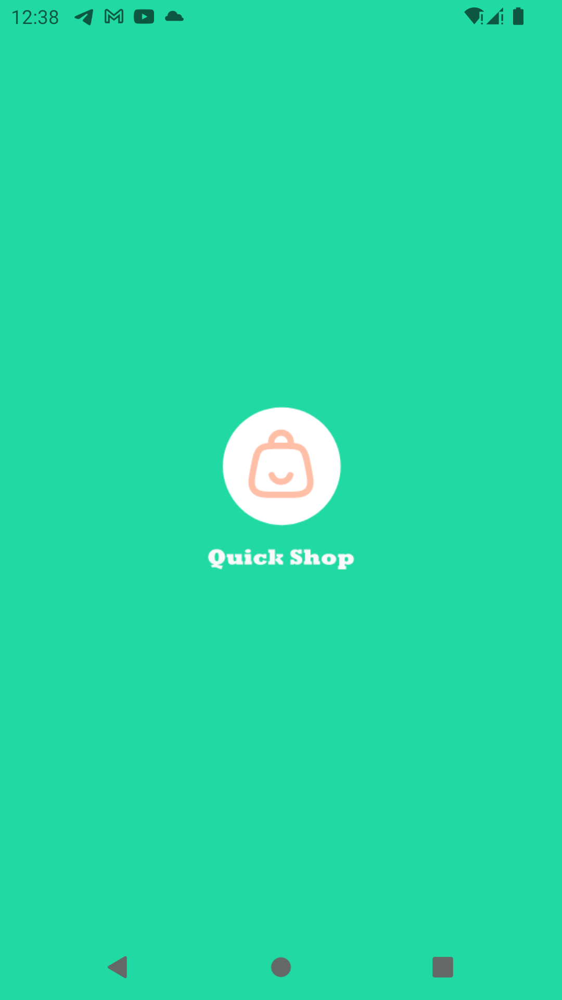
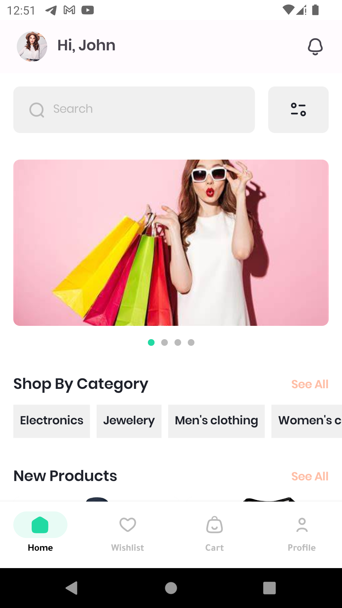
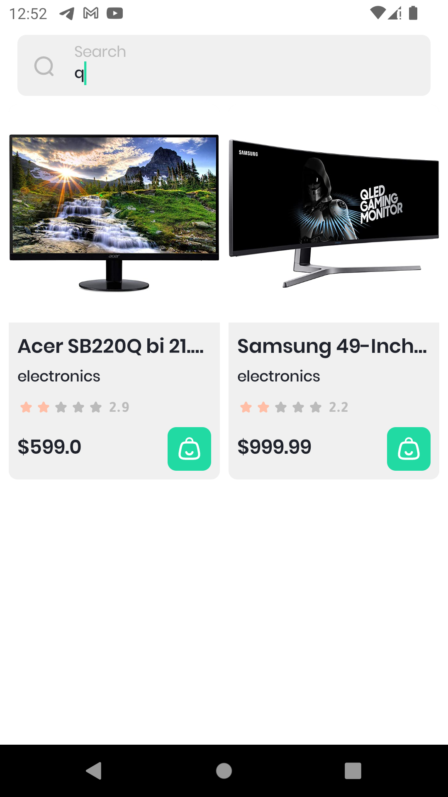
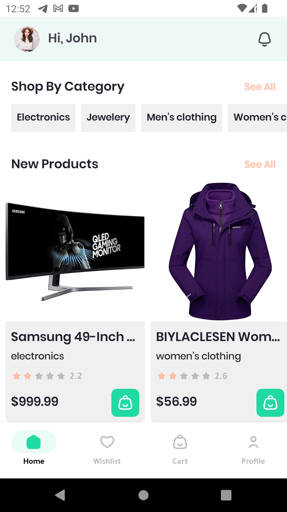
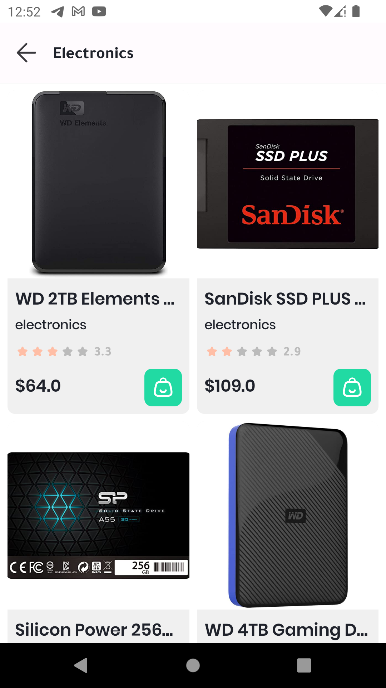
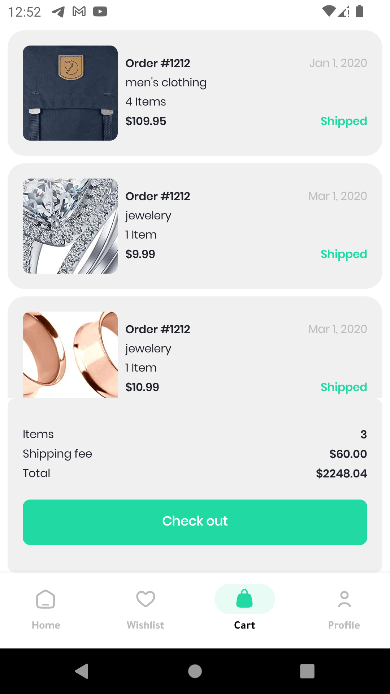
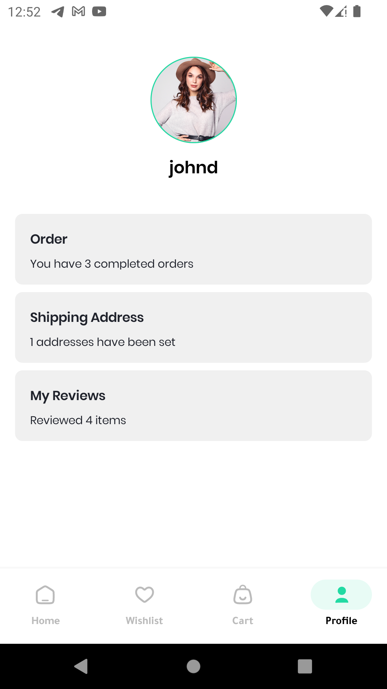
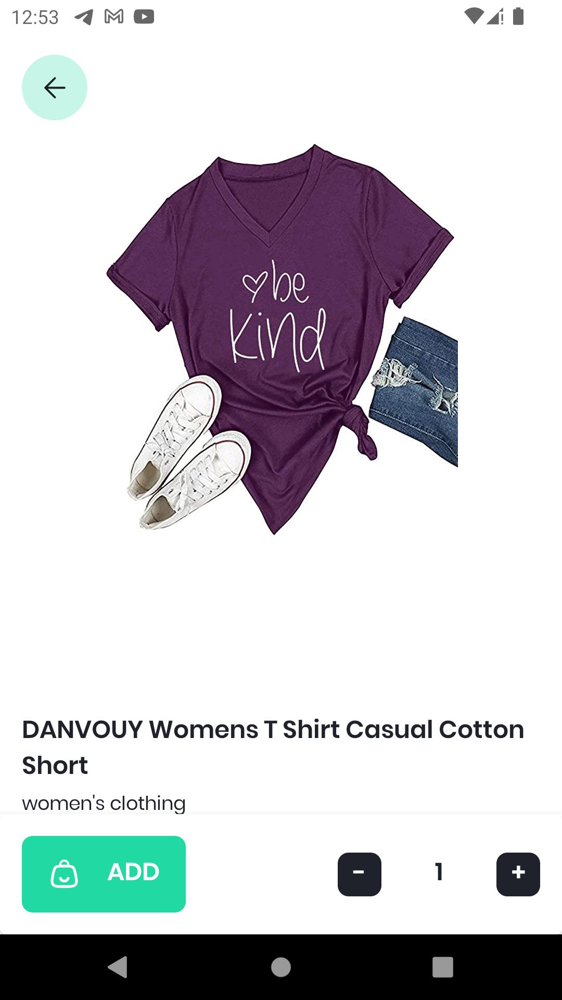

# 📱 QUICK SHOP

  

QuickShop app built with Jetpack Compose by using [Fake Store Api](https://fakestoreapi.com/) and this repository has some endpoints like:
1. Get all products.
2. Get all categories.
3. Get all categories and more.

## [Video](https://streamable.com/wpjaik)

## Images

 

 

  

## Reminder
this API has some endpoints does not anything like login, signup, or add products to a cart it's just a simple simulation of shipping API and this will help you to practice and build a simple app.

## 🚀: Features

- Search for products by name
- Show all details about the product
- Simple profile for user
- Cart screen to show carts that the user adds to the cart
- And several good things

## Tech Stack

1. [Kotlin](https://developer.android.com/kotlin)
2. [Jetpack components](https://developer.android.com/jetpack/compose)
3. [Clean Architecture](https://blog.cleancoder.com/uncle-bob/2012/08/13/the-clean-architecture.html)
4. [Retrofit](https://square.github.io/retrofit/)
5. [Dagger Hilt](https://developer.android.com/training/dependency-injection/hilt-android)
6. [Logging Interceptor](https://github.com/square/okhttp/blob/master/okhttp-logging-interceptor/README.md)
7. [Coil](https://coil-kt.github.io/coil/compose/)
8. [Splash Screen](https://www.bing.com/search?pglt=673&q=androidx.core%3Acore-splashscreen%3A1.0.1&cvid=17963b48013b4e2fa56b8807ad373991&aqs=edge.0.69i59.368j0j1&FORM=ANNTA1&PC=SCOOBE)

## Prerequisites

Before running the app, ensure that you have the following:

- Android Studio (version 2022.2.1 or higher)
- Java Development Kit (JDK) (version 1.8 or higher)

## Contributing

Contributions to the QUICK SHOP Android app are welcome! If you encounter any issues or want to contribute new features, please submit an issue or pull request on the GitHub repository.

When contributing, please follow these guidelines:

- Fork the repository and create a new branch for your feature or bug fix.
- Ensure your code adheres to the project's coding style and conventions.
- Write clear and concise commit messages and provide a detailed description of your changes.
- Thoroughly test your changes before submitting a pull request.

